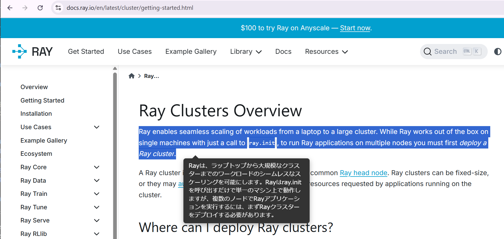
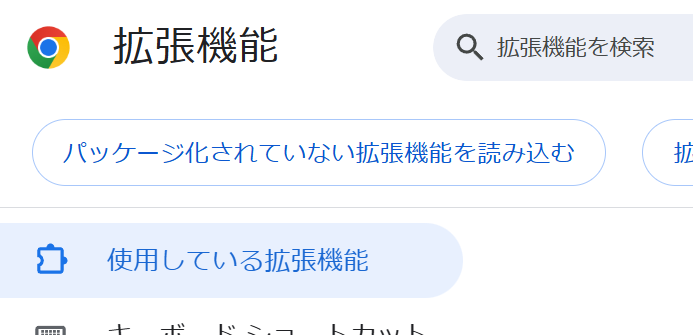
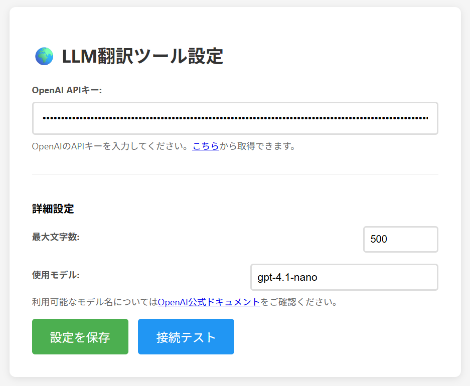

# Chrome GPT Translator

選択したテキストをOpenAI GPTで瞬時に翻訳するChrome拡張機能です。



## 特徴

- 🖱️ **ドラッグ選択で翻訳** - 英語テキストをマウスで選択するだけで翻訳
- ⚡ **瞬時に表示** - ドラッグ終了と同時に翻訳結果をポップアップ表示
- 🤖 **GPTモデル使用** - OpenAIの最新GPTモデルで高品質な翻訳
- ⚙️ **カスタマイズ可能** - モデル名、最大文字数を自由に設定
- 📝 **シンプル設計** - 余計な説明文なし、翻訳結果のみを表示

## インストール

### 1. ファイルのダウンロード
```bash
git clone https://github.com/yourusername/chrome-gpt-translator.git
cd chrome-gpt-translator
```

### 2. Chrome拡張機能として読み込み
1. Chromeで `chrome://extensions/` を開く<br><br>
2. 右上の「デベロッパーモード」をON
<br><br>
3. 「パッケージ化されていない拡張機能を読み込む」をクリック
<br><br>
4. ダウンロードしたフォルダを選択

## 設定

### 1. APIキーの設定
1. 拡張機能の「詳細」→「拡張機能のオプション」をクリック
2. [OpenAI API Keys](https://platform.openai.com/api-keys)でAPIキーを取得
3. APIキーを入力して「設定を保存」

### 2. 詳細設定（オプション）
- **使用モデル**: デフォルトは `gpt-4.1-nano`（自由に変更可能）
- **最大文字数**: デフォルトは500文字（1-2000文字で設定可能）

### 3. 接続テスト
「接続テスト」ボタンでAPI接続を確認してください。

## 使用方法

1. 任意のWebページで英語テキストをマウスでドラッグ選択
2. ドラッグを終了すると翻訳結果がポップアップ表示
3. 翻訳結果は10秒後に自動消去（クリックで手動消去も可能）

## 対応モデル

OpenAI GPTモデルに対応しています

## よくある質問

**Q: 翻訳されない**  
A: 以下を確認してください
- APIキーが正しく設定されているか
- 選択テキストに英語が含まれているか
- 最大文字数を超えていないか

**Q: 料金について**  
A: OpenAI APIの従量課金制です。使用量に応じて料金が発生します。

**Q: 他の言語への翻訳**  
A: 現在は英語→日本語のみ対応。他言語は`content.js`のプロンプト修正で対応可能。

## ライセンス

MIT License
